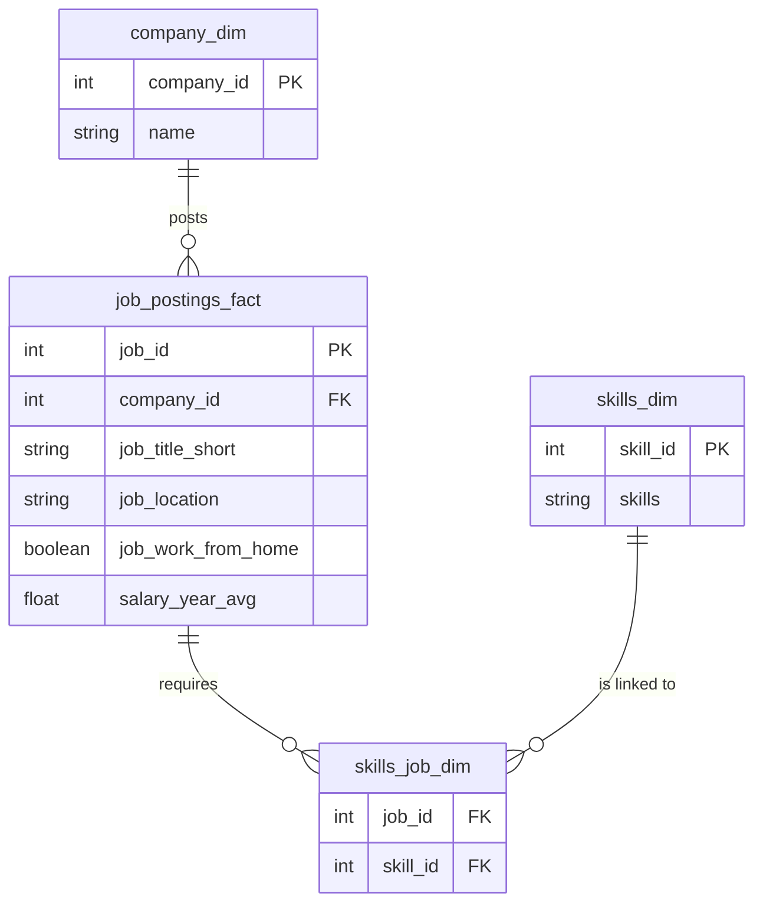
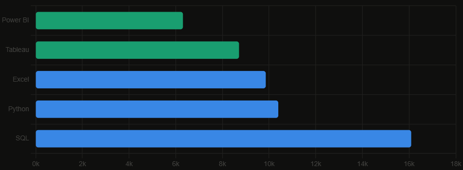
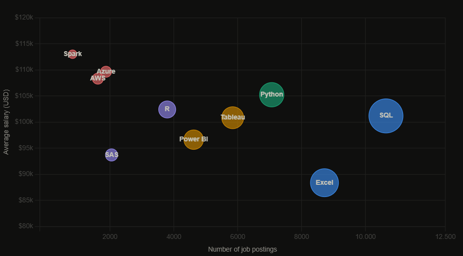

# Cracking the Data Analyst Job Market with SQL

A deep dive into the data job market using SQL — exploring salary ceilings, in-demand skills, and the sweet spot between what pays well and what gets you hired.

By querying a real-world dataset of job postings, I set out to answer the questions every aspiring data professional has on their mind: which roles pay the most? Which skills should I prioritize? And where exactly is the overlap between high demand and high salary?

> Spoiler: learn SQL.

---

## Database Schema

The analysis runs on a relational database of job postings, companies, and skills. The schema is straightforward — four tables joined through foreign keys.



---

## Questions Explored

The project is structured around five core questions, each answered with a dedicated SQL query.

1. What are the top-paying remote Data Analyst jobs?
2. What skills do those top-paying jobs require?
3. What are the most in-demand skills across all postings?
4. What skills command the highest average salary?
5. What are the most *optimal* skills — high demand AND high pay?

---

## 1. The salary ceiling — top-paying remote roles

Filtering for remote positions (`job_location = 'Anywhere'`) with explicit salary data surfaces the true ceiling for Data Analyst compensation.

```sql
SELECT
    job_id,
    job_title,
    job_location,
    job_schedule_type,
    salary_year_avg,
    job_posted_date,
    name AS company_name
FROM job_postings_fact
LEFT JOIN company_dim ON job_postings_fact.company_id = company_dim.company_id
WHERE
    job_title_short = 'Data Analyst'
    AND job_location = 'Anywhere'
    AND salary_year_avg IS NOT NULL
ORDER BY salary_year_avg DESC
LIMIT 10;
```

| Company | Job Title | Avg Salary (USD) |
|---|---|---|
| Mantys | Data Analyst | $650,000 |
| Netflix | Analytics Engineer (L5) | $445,000 |
| Siemens | Financial & Data Analyst | $385,000 |
| Meta | Director of Analytics | $336,500 |

**Insight:** The ceiling is exceptionally high — $650k at Mantys. Netflix appears multiple times in the top 10. Notice how the highest-paying roles tend to blur the boundary between "Data Analyst" and "Analytics Engineer" or "Director", suggesting that leveling up in title and scope is where the real salary jumps happen.

---

## 2. The elite arsenal — skills behind the top jobs

Knowing who pays well is only half the picture. The more useful question is what you need to know to get the interview.

```sql
WITH top_paying_jobs AS (
    SELECT
        job_id,
        job_title,
        salary_year_avg,
        name AS company_name
    FROM job_postings_fact
    LEFT JOIN company_dim ON job_postings_fact.company_id = company_dim.company_id
    WHERE
        job_title_short = 'Data Analyst'
        AND job_location = 'Anywhere'
        AND salary_year_avg IS NOT NULL
    ORDER BY salary_year_avg DESC
    LIMIT 10
)
SELECT
    top_paying_jobs.*,
    skills
FROM top_paying_jobs
INNER JOIN skills_job_dim ON top_paying_jobs.job_id = skills_job_dim.job_id
INNER JOIN skills_dim ON skills_job_dim.skill_id = skills_dim.skill_id
ORDER BY salary_year_avg DESC;
```

**Insight:** Earning half a million dollars requires a skill set closer to a software engineer than a traditional analyst. Netflix expects Python, SQL, Go, Scala, and TypeScript. Siemens, by contrast, still leans heavily on Excel and SAP — a reminder that "top-paying" looks very different across industries.

---

## 3. The most in-demand skills

For anyone starting out, this is the most actionable question: what does the majority of the market actually ask for?

```sql
SELECT
    skills,
    COUNT(skills_job_dim.job_id) AS demand_count
FROM job_postings_fact
INNER JOIN skills_job_dim ON job_postings_fact.job_id = skills_job_dim.job_id
INNER JOIN skills_dim ON skills_job_dim.skill_id = skills_dim.skill_id
WHERE
    job_title_short = 'Data Analyst'
    AND job_work_from_home = TRUE
GROUP BY skills
ORDER BY demand_count DESC
LIMIT 5;
```



**Insight:** SQL, Python, and Excel form the non-negotiable foundation. Visualization tools — Tableau and Power BI — follow closely. If you are building a learning roadmap from scratch, these five skills alone would make you competitive in the vast majority of remote Data Analyst roles.

---

## 4. The highest-paying skills

Once you have the fundamentals, specialization is where salary acceleration happens. This query identifies which skills are most financially rewarded.

```sql
SELECT
    skills,
    ROUND(AVG(salary_year_avg), 0) AS avg_salary
FROM job_postings_fact
INNER JOIN skills_job_dim ON job_postings_fact.job_id = skills_job_dim.job_id
INNER JOIN skills_dim ON skills_job_dim.skill_id = skills_dim.skill_id
WHERE
    job_title_short = 'Data Analyst'
    AND salary_year_avg IS NOT NULL
    AND job_work_from_home = TRUE
GROUP BY skills
ORDER BY avg_salary DESC
LIMIT 10;
```


| Skill | Avg Salary (USD) |
|---|---|
| TypeScript | $445,000 |
| Go | $342,019 |
| Scala | $296,875 |
| GraphQL | $264,000 |
| Bitbucket | $189,155 |
| Node.js | $170,813 |
| PySpark | $161,971 |

**Insight:** The top-paying skills are almost entirely software engineering and DevOps tools — TypeScript, Go, Scala, GraphQL, Bitbucket. This is a clear signal: Data Analysts who can operate in a production engineering environment, write deployable code, and integrate with developer workflows command a significant premium over those who stay within traditional BI tooling.

---

## 5. The sweet spot — optimal skills to learn

The final question combines both dimensions: which skills appear frequently in job postings *and* pay well? This is the most actionable output of the entire project.

```sql
SELECT
    skills_dim.skill_id,
    skills_dim.skills,
    COUNT(skills_job_dim.job_id) AS demand_count,
    ROUND(AVG(job_postings_fact.salary_year_avg), 0) AS avg_salary
FROM job_postings_fact
INNER JOIN skills_job_dim ON job_postings_fact.job_id = skills_job_dim.job_id
INNER JOIN skills_dim ON skills_job_dim.skill_id = skills_dim.skill_id
WHERE
    job_title_short = 'Data Analyst'
    AND salary_year_avg IS NOT NULL
GROUP BY skills_dim.skill_id, skills_dim.skills
HAVING COUNT(skills_job_dim.job_id) > 10
ORDER BY demand_count DESC, avg_salary DESC
LIMIT 10;
```



| Skill | Demand Count | Avg Salary (USD) |
|---|---|---|
| SQL | 10,641 | $101,184 |
| Excel | 8,716 | $88,385 |
| Python | 7,064 | $105,238 |
| Tableau | 5,842 | $100,835 |
| Power BI | 4,620 | $96,630 |
| R | 3,792 | $102,417 |
| Azure | 1,875 | $109,642 |
| AWS | 1,620 | $108,317 |
| Spark | 829 | $113,003 |

**Insight:** SQL and Python sit in a category of their own — massive demand combined with six-figure average salaries. The bubble chart makes the tradeoff visible: cloud tools like Azure, AWS, and Spark push salary higher but with considerably fewer postings. For a career-starting strategy, the data points clearly toward SQL and Python first. For someone looking to specialize and negotiate upward, cloud and pipeline skills are where the ceiling lifts.

---

## Tools Used

- **PostgreSQL** — CTEs, window functions, joins, aggregations
- **GitHub** — version control and project documentation
- **Chart.js** — data visualizations (see `assets/`)

---

## Assets

The charts in this README were generated from the query results and are available as standalone files:

- `assets/skill_demand.png` — top 5 in-demand skills
- `assets/top_paying_skills.png` — top 10 highest-paying skills
- `assets/optimal_skills.png` — demand vs. salary bubble chart
- `assets/sql_job_market_charts.html` — interactive version of all three charts (download individual PNGs from within the page)