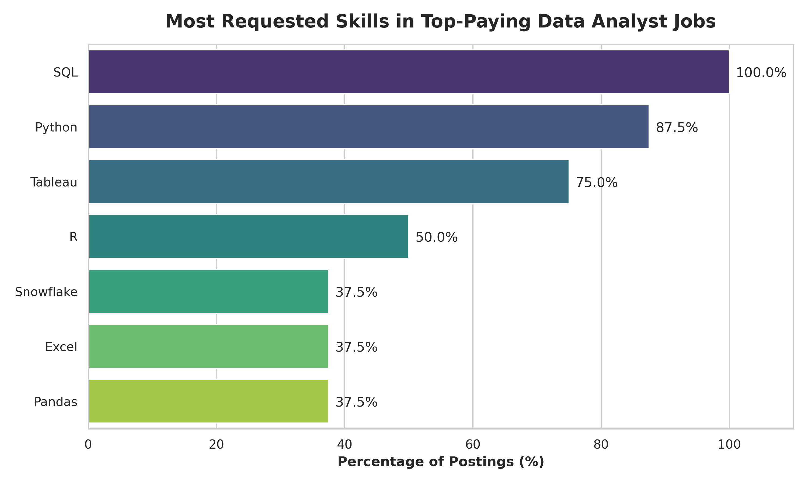
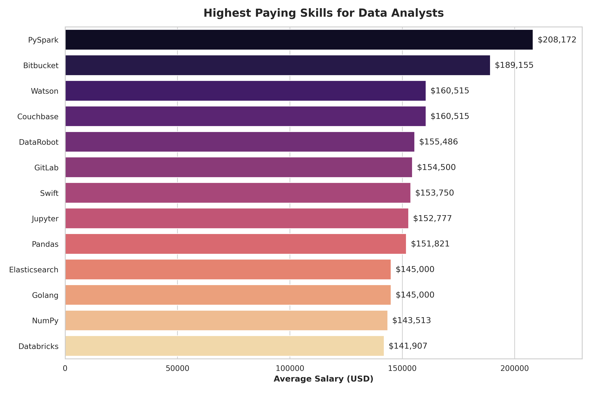

DISCLAIMER: This README is a bit poor, it's done by Gemini just to have something, 
I promise I will review it when I'll have some time!

# Data Analyst Job Market Analysis

## Intro
This project explores the data analyst job market, focusing on the highest-paying jobs, most in-demand skills, and the intersection of the two. The goal is to provide actionable insights for data professionals looking to optimize their skill sets and maximize their earning potential.

SQL queries used for this analysis can be found here: [project_sql](/project_sql)

## Background
The data domain is constantly evolving. I embarked on this project to understand the current landscape for Data Analysts. Specifically, I wanted to answer:
1. What are the top-paying Data Analyst jobs?
2. What skills are required for these top-paying jobs?
3. What are the most in-demand skills overall?
4. What skills are associated with the highest salaries?
5. What are the most "optimal" skills to learn (high demand + high salary)?

##  Tools Used
- **PostgreSQL**: Used as the primary relational database to store, query, and analyze the job postings data.
- **SQL**: Used to write complex queries including `JOIN`s, `WITH` clauses (CTEs), and aggregations to extract insights.
- **Git & GitHub**: Version control and sharing my SQL scripts and analysis.
- **VS Code**: For database management and executing SQL queries.
- **Python (Pandas, Matplotlib, Seaborn)**: Added for advanced data visualization and generating repository assets.

##  The Analysis
### 1. Top Paying Data Analyst Jobs
The highest-paying roles are often senior, principal, or director-level positions, frequently offering remote flexibility. Companies like AT&T, Pinterest, and SmartAsset are leading the compensation charts for these specialized roles.

### 2. Skills for Top Paying Jobs
Looking at the top-tier jobs, foundational skills and modern data stack tools dominate:
- **SQL** is undisputed, appearing in **100%** of the top-paying job postings analyzed.
- **Python** follows closely (87.5%), proving to be the scripting language of choice.
- **Tableau** (75%) remains the dominant visualization tool.

### 3. Top Paying Skills
The most lucrative skills reflect a shift towards Big Data, Cloud orchestration, and DevOps:
- **PySpark** commands the highest average salary at **~$208k**.
- DevOps tools like **Bitbucket** (~$189k) and **GitLab** (~$154k) show that analytics engineering and version control are highly rewarded.
- Machine Learning platforms (Watson, DataRobot) also sit at the top of the salary brackets.

### 4. Optimal Skills (High Demand + High Pay)
To maximize ROI on learning, the optimal skills blend high market demand with premium compensation. While highly specialized tools pay the most, core tools like Python, SQL, and cloud platforms offer the best balance of abundant job opportunities and high salaries.

##  What I Learned
- **SQL is Non-Negotiable**: It is the absolute foundation for any high-paying data role.
- **Python > R for Top Salaries**: While both are valuable, Python is more ubiquitous in the highest-paying tiers.
- **The "DevOps" Premium**: Data Analysts who understand engineering workflows (Git, CI/CD, Cloud) have a massive competitive advantage.
- **Big Data = Big Pay**: Skills like PySpark, Databricks, and Snowflake are major differentiators.

##  Conclusion
The modern Data Analyst is expected to be more technical than ever. Mastering SQL and Python is the baseline, but the real salary multipliers come from understanding cloud infrastructure, big data processing, and engineering best practices.
